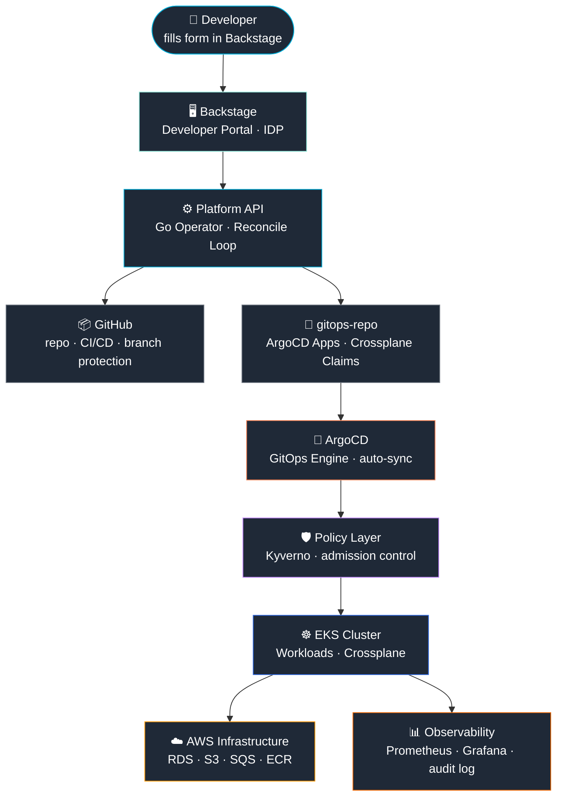

<div align="center">


<br/>

[](https://linkedin.com/in/hugosleao)
[](https://github.com/hugosleao)
[](mailto:hugosleao.dev@gmail.com)
[](https://medium.com/@hugosleao)


</div>

---

## About

My background is in DevOps and cloud automation, and today my focus is on **Platform Engineering and Cloud Architecture** — building and evolving cloud-native platforms that enable teams to ship software faster with reliable infrastructure, automation and strong engineering practices.

Inspired by how companies like **Spotify, Netflix and Mercado Livre** design Internal Developer Platforms — where a developer requests a service and the platform automatically provisions the repository, CI/CD, infrastructure and observability. No tickets. No manual steps. No AWS console access.

```
DevOps  ──────────────────────────────────────────────────▶  Platform Engineering
         Infrastructure    GitOps      Control Planes
         Automation        Systems     & IDPs
```

---

## 🏗️ Current Focus

| Area | What I'm working on |
|:---|:---|
| **Platform Engineering** | Internal Developer Platforms with developer self-service |
| **Control Plane Architecture** | Go Operators using `controller-runtime` + Kubernetes CRDs |
| **Cloud Architecture (AWS)** | EKS, Crossplane, VPC, IAM, Secrets Manager, OIDC |
| **GitOps** | ArgoCD ApplicationSets, multi-environment GitFlow |
| **Developer Experience** | Backstage portals, Golden Path templates, service scaffolding |
| **Infrastructure Abstraction** | Crossplane XRDs and Compositions for RDS, S3, SQS |

---

## ✅ Platform Capabilities

```
✔  Self-service service provisioning  — developer fills form, platform delivers
✔  GitOps continuous delivery         — Git is the only source of truth
✔  Infrastructure abstraction         — Crossplane Compositions for RDS · S3 · SQS
✔  Policy as code                     — Kyverno enforces standards at admission
✔  Developer portal                   — Backstage catalog, templates, scorecards
✔  Control plane architecture         — Go Operators with reconciliation loops
✔  Zero static credentials            — GitHub Actions OIDC + AWS STS
✔  Automated TLS                      — cert-manager + Let's Encrypt + Route53
```

---

## 🔬 Platform Engineering Lab

This GitHub profile documents my ongoing work designing and experimenting with **Internal Developer Platforms, Kubernetes control planes and cloud-native platform architectures**.

---

## 🚀 Featured Project

<div align="center">

### [platform-engineering-reference](https://github.com/hugosleao/platform-engineering-reference)

Reference architecture for building **Internal Developer Platforms on Kubernetes** — Backstage, ArgoCD, Crossplane and AWS.


</div>

> Production-grade **Internal Developer Platform** on Kubernetes.
> Same architecture principles used by **Spotify · Netflix · Mercado Livre · Uber**.

**Internal Developer Platform Architecture**



**What makes it different:** a Kubernetes **Operator** (Go + controller-runtime) continuously reconciles state — if a resource is deleted, it's recreated automatically. No manual intervention.

```
Developer fills a form in Backstage
  │
  ├──▶ Platform API (Go Operator) reconciles desired state
  │         │
  │         ├──▶ GitHub: repo + branch protection + CI/CD
  │         ├──▶ ArgoCD: Applications (dev / hml / prd)
  │         └──▶ Crossplane: RDS · S3 · SQS on AWS
  │
  └──▶ Developer gets a running service in minutes
```

---

## 🛠️ Tech Stack

<div align="center">

**Platform Engineering**


**Cloud & Infrastructure**


**Development**


**Observability**


</div>

---

## 📐 Engineering Approach

I study and build using three layers — ensuring knowledge stays valid even when tools evolve:

```
CONCEPT                   PATTERN                      IMPLEMENTATION
──────────────────────    ──────────────────────────   ────────────────────────
Continuous Delivery    →  GitOps                    →  ArgoCD
Operator Pattern       →  Controller + Reconcile    →  Platform API (Go)
Infrastructure IaC     →  Control Plane API         →  Crossplane
Policy as Code         →  Admission Control         →  Kyverno
Self-service           →  Developer Portal          →  Backstage
```

> Technology is secondary. **Architectural thinking is primary.**

---

## 🧭 Architecture Interests

```
• Internal Developer Platforms (IDP)
• Control Plane Architecture
• Cloud Native Systems Design
• Developer Experience Engineering
• Platform APIs and Infrastructure Abstraction
• GitOps and Continuous Delivery Systems
• Kubernetes Operators and CRD-driven workflows
• Policy as Code and Platform Governance
```

---

## 📚 Learning Journey

| Book | Author | What it influences |
|:---|:---|:---|
| **Platform Engineering on Kubernetes** | Mauricio Salatino | IDP architecture, Crossplane, ArgoCD |
| **Kubernetes Patterns** | Ibryam & Huß | Operator pattern, CRDs, reconcile loops |
| **Cloud Native DevOps with Kubernetes** | Arundel & Domingus | GitOps, observability, security |
| **API Design Patterns** | JJ Geewax | Control plane APIs, resource lifecycle |
| **Crafting Engineering Strategy** | Will Larson | Platform as product, engineering strategy |
| **Team Topologies** | Skelton & Pais | Platform team model, cognitive load, fast flow |
| **AWS SAA-C03** | Amazon | Cloud architecture, services, networking *(in progress)* |

---

<div align="center">

*Building platforms where developers focus on code — the platform handles everything else.*

</div>
